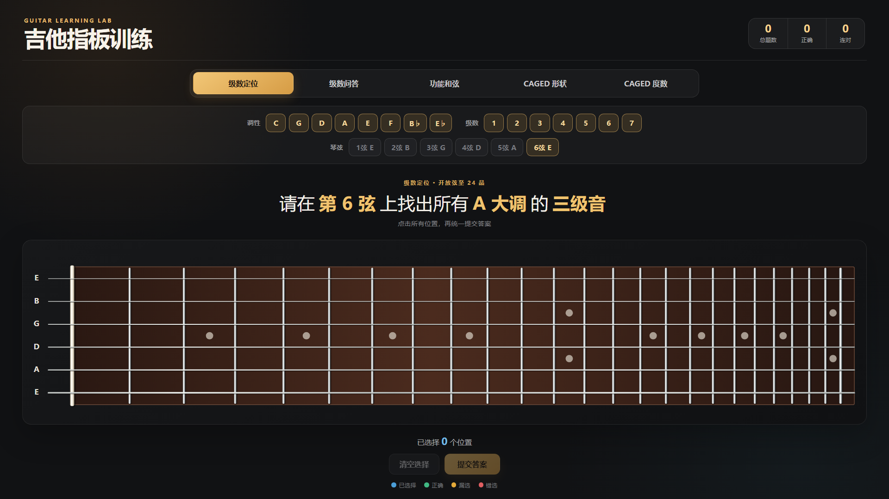
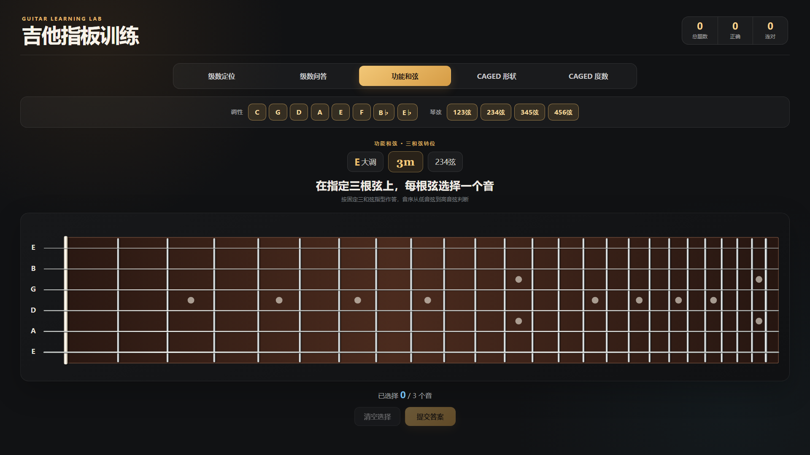
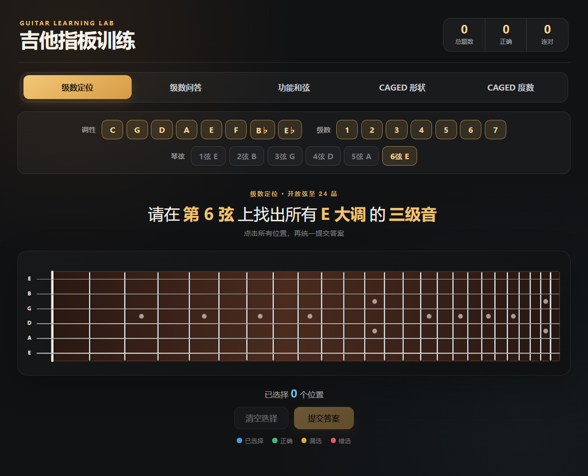

# 吉他指板训练

一个把大调级数、音名、功能和弦、三和弦转位与吉他指板位置连接起来的交互式训练工具。

**在线体验：** [https://pieterseyale-eng.github.io/guitar-learning/](https://pieterseyale-eng.github.io/guitar-learning/)

## 项目简介

很多理论练习只要求写出答案，例如“D 大调六级是什么音或和弦”，但真正演奏时还需要立即在指板上找到它。本项目把这两步合在一起：先理解调内级数，再将答案落实到标准调弦吉他的具体弦和品位。

主应用位于 `caged-trainer/`，使用 React、TypeScript 和 SVG 实现，无需后端服务。



## 训练模式

| 模式 | 训练内容 |
| --- | --- |
| 级数定位 | 根据调性与级数，在选定琴弦上找出该音的全部位置 |
| 级数问答 | 根据“某大调的某级音”输入对应音名 |
| 功能和弦 | 在指定连续三弦组上完成调内三和弦及其转位 |
| CAGED 形状 | 观察指板音位，判断对应的 CAGED 形状 |
| CAGED 度数 | 观察 CAGED 指型中的高亮音，判断其音级 |

### 可选出题范围

- 调性：C、G、D、A、E、F、B♭、E♭ 大调。
- 级数定位：可选择 1–7 级以及任意一根或多根琴弦。
- 功能和弦：可选择调性以及 `123弦`、`234弦`、`345弦`、`456弦`。
- CAGED 度数：可选择 C、A、G、E、D 指型。
- 页面统一记录总题数、正确数和连续答对数。

## 功能和弦与三和弦转位

题目会随机生成调性、功能和弦、转位与连续三弦组，例如：

```text
B♭ 大调 3m/7，123弦
```

此时：

1. B♭ 大调的三级和弦是 Dm，即 D–F–A。
2. `/7` 表示最低音是 B♭ 大调的七级音 A。
3. A 是 Dm 的五音，因此题目要求第二转位。
4. 从低音弦到高音弦的目标顺序是 `5–1–♭3`，即 A–D–F。



### 固定指型规则

程序为以下组合建立了 24 套固定三和弦指型模板：

- 4 个连续三弦组：123、234、345、456弦。
- 2 种性质：Major、Minor。
- 3 种位置：原位、第一转位、第二转位。

允许的音级顺序为：

| 和弦性质 | 原位 | 第一转位 | 第二转位 |
| --- | --- | --- | --- |
| Major | 1–3–5 | 3–5–1 | 5–1–3 |
| Minor | 1–♭3–5 | ♭3–5–1 | 5–1–♭3 |

判题不是简单检查三个音名，而是同时检查弦号、品位、音高类别、音级顺序和固定指型。一个合法指型可以整体移动 12 品得到高八度等价答案，但不接受任意混合八度或重新排列出的 voicing。Slash bass 也必须是当前三和弦内部的根音、三音或五音。

提交后会显示实际和弦名、转位类型、目标音级顺序、用户所选音名，以及 0–24 品内全部合法指型位置。

## 指板实现

- 标准调弦：E–A–D–G–B–E。
- 范围：开放弦到第 24 品。
- 采用 25.5 英寸（648 mm）弦长和十二平均律公式计算自然品距：

```text
d(n) = L × (1 - 2^(-n/12))
```

- 0 品位置绘制为琴枕，1–24 品绘制为带高光和阴影的金属品丝。
- 第 24 品后保留一小段指板和琴弦，避免视觉上在品丝处突然截断。
- 六根琴弦位于指板内部，粗细按真实吉他从一弦到六弦逐渐增加。
- 指板使用响应式 SVG；桌面、iPad 横屏和竖屏均完整显示 24 品，不需要横向滚动。



## 技术栈

- React 19
- TypeScript 5.9
- Vite 7
- SVG 指板渲染
- ESLint 9
- GitHub Actions 与 GitHub Pages

## 本地运行

建议使用 Node.js 22。

```bash
git clone https://github.com/pieterseyale-eng/guitar-learning.git
cd guitar-learning/caged-trainer
npm install
npm run dev
```

Vite 会在终端输出本地访问地址。

## 构建与检查

在 `caged-trainer/` 目录运行：

```bash
npm run lint
npm run build
npm run preview
```

| 命令 | 作用 |
| --- | --- |
| `npm run dev` | 启动本地开发服务器 |
| `npm run lint` | 执行 ESLint 代码检查 |
| `npm run build` | 执行 TypeScript 检查并生成生产构建 |
| `npm run preview` | 本地预览生产构建 |

## 项目结构

```text
guitar-learning/
├─ .github/workflows/
│  └─ deploy-pages.yml          # GitHub Pages 自动部署
├─ caged-trainer/               # 当前主应用
│  ├─ src/
│  │  ├─ data/                  # 大调、指板和功能和弦规则
│  │  ├─ engine/                # CAGED 出题与指型放置
│  │  ├─ shapes/                # CAGED 数据解析与类型
│  │  ├─ App.tsx                # 页面状态、模式与判题流程
│  │  └─ FretboardSvg.tsx       # 24 品响应式 SVG 指板
│  └─ package.json
├─ docs/screenshots/            # README 页面截图
├─ scale-trainer/               # 大调音阶与常用进行练习原型
├─ memory——diao/                # 单页调式记忆原型
└─ memory fingerboard/          # 指板学习需求与说明资料
```

## 调试模式

在地址后加入 `?debug=1`，CAGED 模式会显示音级标签和根音位置：

```text
http://localhost:5173/guitar-learning/?debug=1
```

## 自动部署

推送到 `main` 分支后，`.github/workflows/deploy-pages.yml` 会自动安装依赖、构建 `caged-trainer`，并发布到 GitHub Pages。

部署地址：[https://pieterseyale-eng.github.io/guitar-learning/](https://pieterseyale-eng.github.io/guitar-learning/)
